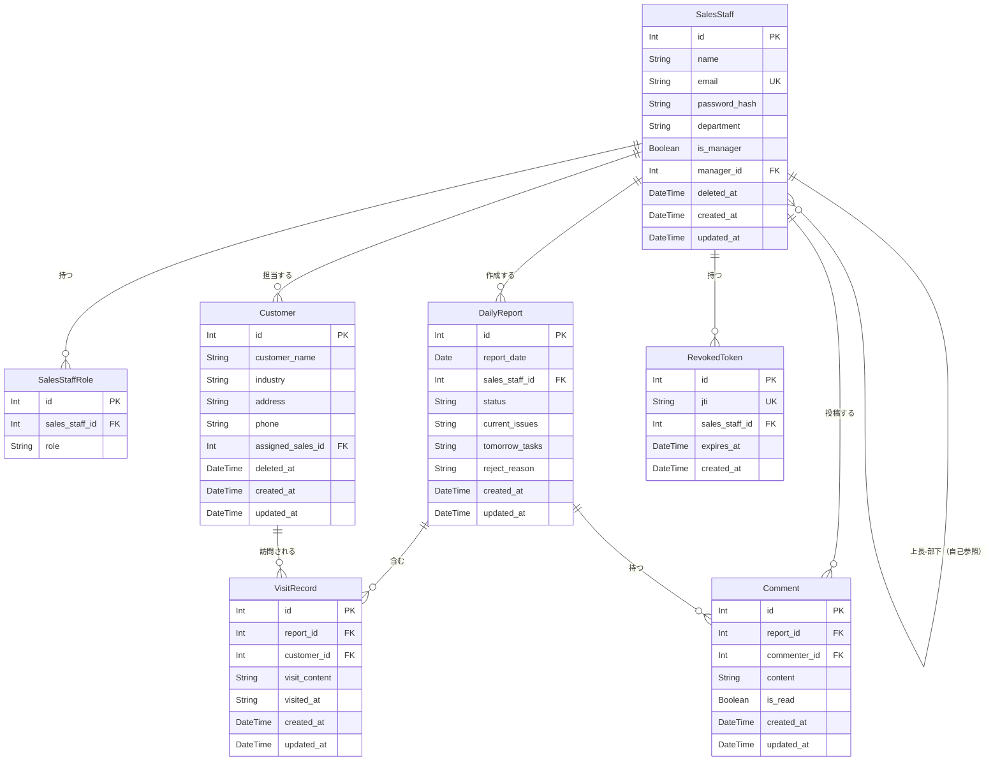

# 営業日報システム ER 図

## 改訂履歴

| バージョン | 日付 | 変更内容 |
|-----------|------|---------|
| 1.0 | 2026-03-04 | 初版作成 |

---

## エンティティ一覧

| エンティティ名 | テーブル名 | 概要 |
|--------------|-----------|------|
| SalesStaff | sales_staff | 営業担当者（ユーザー） |
| SalesStaffRole | sales_staff_roles | 営業担当者ロール（中間テーブル） |
| Customer | customers | 顧客マスタ |
| DailyReport | daily_reports | 日報 |
| VisitRecord | visit_records | 訪問記録 |
| Comment | comments | コメント |
| RevokedToken | revoked_tokens | ログアウト済みトークン管理 |

---

## ER 図（Mermaid）

---

## テーブル定義

### sales_staff（営業担当者）

| カラム名 | 型 | NULL | PK/UK/FK | 説明 |
|---------|-----|------|---------|------|
| id | INT | NOT NULL | PK | 営業担当者ID |
| name | VARCHAR(50) | NOT NULL | - | 氏名 |
| email | VARCHAR(255) | NOT NULL | UK | メールアドレス（ログインID） |
| password_hash | VARCHAR(255) | NOT NULL | - | ハッシュ化済みパスワード |
| department | VARCHAR(50) | NULL | - | 部署名 |
| is_manager | BOOLEAN | NOT NULL | - | 上長フラグ（デフォルト: false） |
| manager_id | INT | NULL | FK → sales_staff.id | 所属上長ID |
| deleted_at | TIMESTAMP | NULL | - | 論理削除日時 |
| created_at | TIMESTAMP | NOT NULL | - | 作成日時 |
| updated_at | TIMESTAMP | NOT NULL | - | 更新日時 |

---

### sales_staff_roles（営業担当者ロール）

| カラム名 | 型 | NULL | PK/UK/FK | 説明 |
|---------|-----|------|---------|------|
| id | INT | NOT NULL | PK | ID |
| sales_staff_id | INT | NOT NULL | FK → sales_staff.id | 営業担当者ID |
| role | ENUM | NOT NULL | - | ロール（SALES / MANAGER / ADMIN） |

- `(sales_staff_id, role)` に複合ユニーク制約

---

### customers（顧客マスタ）

| カラム名 | 型 | NULL | PK/UK/FK | 説明 |
|---------|-----|------|---------|------|
| id | INT | NOT NULL | PK | 顧客ID |
| customer_name | VARCHAR(100) | NOT NULL | - | 顧客名 |
| industry | VARCHAR(50) | NULL | - | 業種 |
| address | VARCHAR(200) | NULL | - | 住所 |
| phone | VARCHAR(20) | NULL | - | 電話番号 |
| assigned_sales_id | INT | NULL | FK → sales_staff.id | 担当営業ID |
| deleted_at | TIMESTAMP | NULL | - | 論理削除日時 |
| created_at | TIMESTAMP | NOT NULL | - | 作成日時 |
| updated_at | TIMESTAMP | NOT NULL | - | 更新日時 |

---

### daily_reports（日報）

| カラム名 | 型 | NULL | PK/UK/FK | 説明 |
|---------|-----|------|---------|------|
| id | INT | NOT NULL | PK | 日報ID |
| report_date | DATE | NOT NULL | - | 報告日 |
| sales_staff_id | INT | NOT NULL | FK → sales_staff.id | 作成者ID |
| status | ENUM | NOT NULL | - | DRAFT / SUBMITTED / CONFIRMED / REJECTED |
| current_issues | VARCHAR(2000) | NULL | - | 今の課題・相談 |
| tomorrow_tasks | VARCHAR(2000) | NULL | - | 明日やること |
| reject_reason | VARCHAR(500) | NULL | - | 差し戻し理由 |
| created_at | TIMESTAMP | NOT NULL | - | 作成日時 |
| updated_at | TIMESTAMP | NOT NULL | - | 更新日時 |

- `(sales_staff_id, report_date)` に複合ユニーク制約（同一担当者の同日日報は1件のみ）

---

### visit_records（訪問記録）

| カラム名 | 型 | NULL | PK/UK/FK | 説明 |
|---------|-----|------|---------|------|
| id | INT | NOT NULL | PK | 訪問記録ID |
| report_id | INT | NOT NULL | FK → daily_reports.id | 日報ID |
| customer_id | INT | NOT NULL | FK → customers.id | 顧客ID |
| visit_content | VARCHAR(1000) | NOT NULL | - | 訪問内容 |
| visited_at | VARCHAR(5) | NULL | - | 訪問時刻（HH:MM 形式） |
| created_at | TIMESTAMP | NOT NULL | - | 作成日時 |
| updated_at | TIMESTAMP | NOT NULL | - | 更新日時 |

- `report_id` の日報が削除された場合はカスケード削除

---

### comments（コメント）

| カラム名 | 型 | NULL | PK/UK/FK | 説明 |
|---------|-----|------|---------|------|
| id | INT | NOT NULL | PK | コメントID |
| report_id | INT | NOT NULL | FK → daily_reports.id | 日報ID |
| commenter_id | INT | NOT NULL | FK → sales_staff.id | 投稿者ID |
| content | VARCHAR(1000) | NOT NULL | - | コメント内容 |
| is_read | BOOLEAN | NOT NULL | - | 既読フラグ（デフォルト: false） |
| created_at | TIMESTAMP | NOT NULL | - | 作成日時 |
| updated_at | TIMESTAMP | NOT NULL | - | 更新日時 |

- `report_id` の日報が削除された場合はカスケード削除

---

### revoked_tokens（失効トークン）

| カラム名 | 型 | NULL | PK/UK/FK | 説明 |
|---------|-----|------|---------|------|
| id | INT | NOT NULL | PK | ID |
| jti | VARCHAR(255) | NOT NULL | UK | JWT ID（トークン識別子） |
| sales_staff_id | INT | NOT NULL | FK → sales_staff.id | 対象ユーザーID |
| expires_at | TIMESTAMP | NOT NULL | - | トークンの有効期限 |
| created_at | TIMESTAMP | NOT NULL | - | 失効日時 |

---

## ステータス Enum 定義

### ReportStatus（日報ステータス）

| 値 | 説明 |
|----|------|
| `DRAFT` | 下書き |
| `SUBMITTED` | 提出済み |
| `CONFIRMED` | 確認済み |
| `REJECTED` | 差し戻し |

### Role（ロール）

| 値 | 説明 |
|----|------|
| `SALES` | 営業担当者 |
| `MANAGER` | 上長 |
| `ADMIN` | 管理者 |
